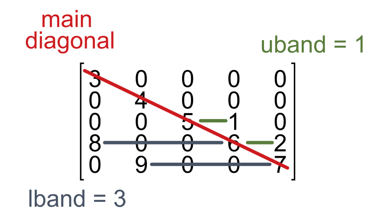

Linear Solvers
==============
SUNDIALS (Suite of Nonlinear and Differential/Algebraic Equation Solvers) provides efficient linear solvers tailored for solving systems of equations arising in scientific computing. The two primary types of linear solvers available in SUNDIALS are ``direct`` and ``iterative`` solvers. These solvers cater to different problem structures, optimizing performance and computational efficiency.

Direct Solvers
--------------
Direct solvers are designed to compute the exact solution of a system of linear equations in a finite number of steps, typically by factorizing the Jacobian matrix. They are most effective for smaller to medium-sized systems or systems with dense matrices, where the computational cost of matrix factorization is not prohibitive. These solvers provide reliable, accurate solutions, but can be less efficient for large or sparse systems.

Dense Solvers 
^^^^^^^^^^^^^
Dense solvers are suitable for systems where the Jacobian matrix is fully populated with non-zero entries. While they can handle banded problems, they may be less efficient than banded solvers in cases where sparsity exists.

When to use:

* Opt for a dense solver when the Jacobian matrix does not exhibit a banded structure.
* Ideal for smaller systems where the overhead of manipulating the problem into a banded structure may outweigh the benefits.

Banded Solvers 
^^^^^^^^^^^^^^
Banded solvers are designed for systems where the Jacobian matrix is sparse and has non-zero entries concentrated around the diagonal. This structure is common in problems derived from finite difference methods or certain discretizations of partial differential equations.

When to use:

* Use a band solver when the Jacobian matrix has a banded structure.
* Beneficial for large systems. When possible, try to order your problem's systems of equations to `minimize the bandwidth`_. For convenience we include a ``reduce_bandwidth`` function to help with this, found in the ``jacband`` module. It uses the reverse Cuthill-McKee heuristic algorithm from ``scipy.sparse.csgraph``. See the full documentation for more information.

.. _minimize the bandwidth: https://sciendo.com/article/10.2478/awutm-2014-0019

Sparse Solvers
^^^^^^^^^^^^^^
Sparse solvers are designed for systems where the Jacobian matrix contains a significant number of zero entries, allowing for more efficient storage and computation by only focusing on non-zero elements. These solvers are particularly useful when dealing with large, sparse systems where maintaining the full matrix would be computationally expensive.

When to use:

* Opt for a sparse solver when the Jacobian matrix is large and sparse, meaning most of its entries are zero.
* Ideal for large-scale systems, especially when the matrix has does not already have a structure that would be suitable for the baneded solver.
* Use sparse solvers to reduce memory usage and improve computational efficiency when the problem involves a sparse matrix.

Configuration in scikit-SUNDAE
^^^^^^^^^^^^^^^^^^^^^^^^^^^^^^
Switching between SUNDIALS direct linear solvers in scikit-SUNDAE is straightforward. While initializing your solver, simply specify which linear solver to use. The ``dense`` linear solver is the default. Changing to a banded linear solver is the same in both the ``CVODE`` and ``IDA`` solvers as demonstrated below:

.. code-block:: python 

    from sksundae.ida import IDA
    from sksundae.cvode import CVODE 

    # IDA with a dummy residuals function
    def resfn(t, y, yp, res):
        pass

    L = 0  # lower bandwidth
    U = 0  # upper bandwidth

    solver = IDA(resfn, linsolver='band', lband=L, uband=U)

    # COVDE with a dummy right-hand-side function
    def rhsfn(t, y, yp):
        pass 

    L = 0  # lower bandwidth
    U = 0  # upper bandwidth
    solver = CVODE(rhsfn, linsolver='band', lband=L, uband=U)

Ensure you provide both the lower bandwidth ``lband`` and upper bandwidth ``uband`` when using the ``band`` linear solver. Each bandwidth defines the LARGEST distance between a non-zero element and the main diagonal, on either side, as shown in the figure below. Forgetting to set either bandwidth will raise an error. If ``lband + uband`` matches the dimension ``N`` of the matrix, the performance of the ``band`` and ``dense`` linear solvers will be approximately the same.

    
In the limiting case where the Jacobian is only non-zero along the main diagonal, both bandwidths can be zero. However, it is unlikely that you will be able to find many, if any, problems that fit this exact form. Alternatively, you can activate the ``sparse`` linear solver by is that is a better fit for your problem. When ``sparse`` is chosen, you must also provide the option ``sparsity`` which provides a sparsity pattern to the solver so it knows how much memory to allocate for the Jacobian, and which indices to track according to the non-zero entries. There are helper functions in the ``jacband`` module that can help you determine the sparsity pattern so you do not always need to construct it manually. See the examples below which demonstrate activating the ``sparse`` linear solver.

.. code-block:: python 

    from sksundae.ida import IDA
    from sksundae.cvode import CVODE 

    # IDA with a dummy residuals function
    def resfn(t, y, yp, res):
        pass

    sparsity = ...  # sparse matrix or 2D array w/ Jacobian sparsity pattern
    solver = IDA(resfn, linsolver='sparse', sparisty=sparsity)

    # COVDE with a dummy right-hand-side function
    def rhsfn(t, y, yp):
        pass 

    sparsity = ...  # sparse matrix or 2D array w/ Jacobian sparsity pattern
    solver = CVODE(rhsfn, linsolver='sparse', sparisty=sparsity)

Iterative Solvers
-----------------
Iterative solvers approximate a linear system's solution by iteratively refining an initial guess. They are particularly well-suited for large, sparse systems where direct solvers would be too computationally expensive. These solvers are often more memory-efficient and faster for large problems, though their stability may require appropriate preconditioning. Implementing a preconditioner is a non-trivial exercise and is generally problem specific. If needed, it is left to the user to define their own preconditioners via ``CVODEPrecond`` and ``IDAPrecond``.

To activate an iterative solver use the ``linsolver`` option with one of the following strings: ``gmres``, ``bicgstab``, or ``tfqmr``. These solvers enable the general minimal residual, bicongugate gradient stabilized, and transpose-free quasi-minimum residual algorithms, respectively. Note that the iterative methods are considered "matrix free" and do not interface with any Jacobian options. Therefore, you will get an error if you attempt to use a Jacobian routine either by passing ``sparsity`` or ``jacfn``.

Configuration in scikit-SUNDAE
^^^^^^^^^^^^^^^^^^^^^^^^^^^^^^
When enabling an iterative solver there are two options that become available: ``krylov_dim`` and ``precond``. The first sets the number of Krylov basis vectors to use in the iterative solver, and the second can be used to define optional preconditioning functions. When not given, ``krylov_dim`` is automatically set to 5 when an iterative solver is specified. The example below gives a skeleton program for using an iterative solver. Note that the preconditioner is completely optional. There are many problems that can be solved using the iterative methods and no preconditioning; however, if your problem is ill-conditioned then the solver will likely run into instabilities without appropriate preconditioning.

.. code-block:: python 

    import numpy as np

    from sksundae.ida import IDA, IDAPrecond
    from sksundae.cvode import CVODE, CVODEPrecond

    # IDA with a dummy residuals function and preconditioner
    def resfn(t, y, yp, res, userdata):
        pass

    def psetupfn(t, y, yp, res, cj, userdata):
        userdata['Pmat'] = ...  # update preconditioner matrix

    def psolvefn(t, y, yp, res, rvec, zvec, cj, delta, userdata):
        Pmat = userdata['Pmat']
        zvec[:] = ...  # fill zvec with solution to Pmat*zvec = rvec

    linsolver = 'gmres'  # or one of {'bicgstab', 'tfqmr'}
    userdata = {'Pmat': np.zeros((..., ...))}
    precond = IDAPrecond(psolvefn, psetupfn)
    solver = IDA(resfn, linsolver=linsolver, precond=precond,
                 userdata=userdata)

    # COVDE with a dummy right-hand-side function and preconditioner
    def rhsfn(t, y, yp, userdata):
        pass

    def psetupfn(t, y, yp, jok, jnew, gamma, userdata):
        if jok:
            jnew[0] = 0
        else:
            jnew[0] = 1
            userdata['JJ'] = ...  # update Jacobian data

    def psolvefn(t, y, yp, rvec, zvec, gamma, delta, lr, userdata):
        Pmat = np.eye(y.size) - gamma*userdata['JJ']

        if lr == 1:  # left preconditioning steps
            zvec[:] = ... 
        elif lr == 2:  # right preconditioning steps
            zvec[:] = ... 

    linsolver = 'gmres'  # or one of {'bicgstab', 'tfqmr'}
    userdata = {'JJ': np.zeros((..., ...))}
    precond = CVODEPrecond(psolvefn, psetupfn, 'both')
    solver = CVODE(rhsfn, linsolver=linsolver, precond=precond,
                   userdata=userdata)

The preconditioning matrices ``Pmat`` for IDA vs. CVODE have differences in their definitions due to the differences in how the solvers define and interact with the user-defined problems. For IDA, ``Pmat`` should approximate the Jacobian ``dF_i/dy_j + cj*dF_i/dyp_j``, at least crudely. Here, ``res = F(t, y, yp)`` are the residuals that define the system of differential-algebraic equations. In contrast, ``Pmat`` for CVODE should approximate ``I - gamma*J`` where ``I`` is the identity matrix and ``J = df_i/dy_j`` is the Jacobian from the system of ODEs defined by ``yp = f(t, y)``. Again, the preconditioner only needs to crudely approximate this definition. While the definitions for the preconditioner vary between IDA and CVODE, the solve steps still perform the same operation, i.e., solving the preconditioned problem ``Pmat*zvec = rvec``. The solvers pre-allocate memory for all arrays, so the functions do not require outputs. Instead, the solve steps fill ``zvec[:]`` with the solution values.

Note that in the outlines above that the preconditioners use ``userdata`` to pass data between the setup step and solve steps. This can also be done in other ways, for example, using global variables. Given that ``userdata`` is not required to be a dictionary, users can determine the best structure for their problem to pass data between functions. When ``userdata`` is provided to a solver, however, all user-defined functions must include it in their signatures. Preconditioning in CVODE is more flexible than in IDA. For example, IDA only supports left preconditioning while CVODE supports left, right, or symmetric (both). Consequently, ``CVODEPrecond`` takes in an extra argument for ``side`` compared to ``IDAPrecond``. The user can set different solve steps according to the side by using the ``lr`` flag which specifies the preconditioner type (1 for left, 2 for right), as shown above.

The setup function for the CVODE preconditioner also has two inputs ``jok`` and ``jnew`` that are not present in the function signature for the IDA preconditioner. It is important to understand these inputs. The argument ``jok`` is a flag that tells the user whether or not the Jacobian data can be reused from a previous step (``jok = 1``) or if it needs to be updated (``jok = 0``). Similarly, the ``jnew`` argument allows the user to tell the solver that the Jacobian data has been updated or not. ``jnew`` is given to the user as a one-element list. You must specifically write to the first index of this list to tell the solver that you have updated the Jacobian data (``jnew[0] = 1``) or not (``jnew[0] = 0``). 

Performance Considerations
--------------------------
Choosing between the direct solvers depends primarily on the structure of your Jacobian matrix. Banded and sparse solvers can significantly reduce memory usage and improve computational speed for large systems, while dense solvers may be more straightforward for smaller, fully populated matrices.

In any case, the default algorithm will numerically approximate the Jacobian for you. However, the ``dense`` routine requires ``N`` function evaluations to approximate the derivative whereas the ``band`` and ``sparse`` options can require significantly fewere, depending on the bandwidth or sparsity pattern, respectively. Note that the Jacobian approximation routine for the ``sparse`` solver is a custom implementation written by scikit-SUNDAE developers. It is not a base routine that comes with SUNDIALS. Consequently, its performance may be less consistent than the difference quotient routines implemented for the ``dense`` and ``band`` solvers. However, for any direct solver you can further improve the performance of either by explicitly providing the Jacobian, as we cover :doc:`here <explicit_jacobians>`.

Iterative solvers offer significant performance advantages for large, sparse systems by avoiding direct factorization of the Jacobian. Instead, they iteratively refine the solution, reducing both memory usage and computational cost compared to direct solvers. However, their efficiency and stability depends on factors such as the conditioning of the system, the choice of preconditioners, and the convergence tolerance.

Unlike direct solvers, iterative methods may require careful tuning to achieve optimal performance. While they can be highly effective for large-scale problems, poor preconditioning or ill-conditioned systems can lead to slow convergence or even divergence. Providing a well-constructed preconditioner can drastically improve both speed and stability; however, identifying a suitable preconditioner is non-trivial.

Further Reading
---------------
For more detailed information on the linear solvers and their implementation, please refer to the `SUNDIALS documentation`_. However, be aware that their full documentation covers more solvers than are implemented in scikit-SUNDAE. 

.. _SUNDIALS documentation: https://sundials.readthedocs.io/en/latest/sunlinsol/index.html
