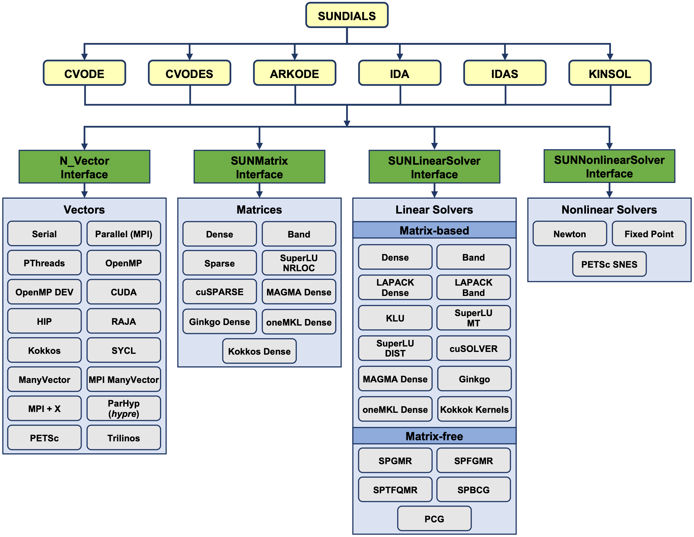

What is scikit-SUNDAE?
======================
Scikit-SUNDAE is a Python package that provides easy-to-use bindings for accessing
two integrators from the `SUNDIALS <https://sundials.readthedocs.io/>`_ suite: CVODE
and IDA. These integrators are widely used for solving complex initial value problems
in differential equations, making scikit-SUNDAE a powerful tool for researchers and
engineers working in computational science and engineering.

SUNDIALS, or the SUite of Nonlinear and DIfferential/ALgebraic equation Solvers, is
a collection of advanced numerical solvers designed for the efficient and robust solution
of differential equations. Within this suite, CVODE and IDA stand out as versatile tools
for specific types of problems:

    * **CVODE:** Specializes in solving ordinary differential equations (ODEs) that
      arise in a variety of fields, such as physics, engineering, and biology. It handles
      both stiff and non-stiff systems of equations, making it adaptable to many real-world
      applications.
    * **IDA:** Solves differential-algebraic equations (DAEs), which often appear in
      systems where some of the equations describe algebraic constraints. These problems
      arise in applications like multi-body dynamics, chemical kinetics, and electrical
      circuits.

Use cases
=========
Both **CVODE** and **IDA** are ideal for problems that involve systems of coupled
differential equations. They are particularly suited to:

    * Time-dependent simulations of physical systems
    * Kinetics and chemical reaction modeling
    * Structural dynamics involving differential-algebraic systems
    * Battery modeling, fuel cell simulations, and energy storage applications

Bindings limitations
====================
While scikit-SUNDAE brings the powerful functionality of CVODE and IDA into the Python
ecosystem, it does not wrap every feature available in the SUNDIALS library. In particular:

    * Only the direct solvers are included, not the iterative solvers that might be used
      in other SUNDIALS-based projects.
    * The package focuses on providing access to the default SUNDIALS vector interfaces,
      matrix interfaces, linear solvers, and nonlinear solvers.
    * Advanced optional interfaces, additional solvers, and external dependencies (such
      as optional preconditioners or iterative methods) are not wrapped in the scikit-SUNDAE
      bindings.

While scikit-SUNDAE offers a convenient interface to key solvers in the SUNDIALS suite,
there is no intention to wrap the entire SUNDIALS library. Given the large number of optional
solvers and interfaces available (shown in the figure below), wrapping everything would be a
significant challenge. Instead, scikit-SUNDAE focuses on providing efficient and streamlined
access to the essential features of the CVODE and IDA integrators, ensuring the package
remains lightweight and user-friendly for solving common ODE and DAE problems.

Acknowledgements
================
We extend our appreciation to the developers and maintainers of the SUNDIALS project for
their exceptional work in creating a robust, reliable, and open-source suite of solvers.
Full details on the SUNDIALS license and copyright information can be found
`here <https://github.com/LLNL/sundials/blob/main/LICENSE>`_.

We also acknowledge the `scikits.odes <https://scikits-odes.readthedocs.io/>`_ project,
which similarly provides Python bindings to SUNDIALS. While scikit-SUNDAE's API was largely
modeled after scikits.odes to maintain a familiar structure, it is important to note that
scikit-SUNDAE is an independently developed package, sharing no source code with scikits.odes.

Depending on your needs, one of the two packages may be more suitable. Scikit-SUNDAE is
designed to be lightweight and straightforward, making it easier to install, especially
for users unfamiliar with SUNDIALS. It is also ideal for projects that only need to link
to these solvers as a dependency. On the other hand, if you need more advanced features,
such as iterative methods, optional solvers (e.g., LAPACK), or greater configurability,
scikits.odes offers a more comprehensive set of tools and customization options.
