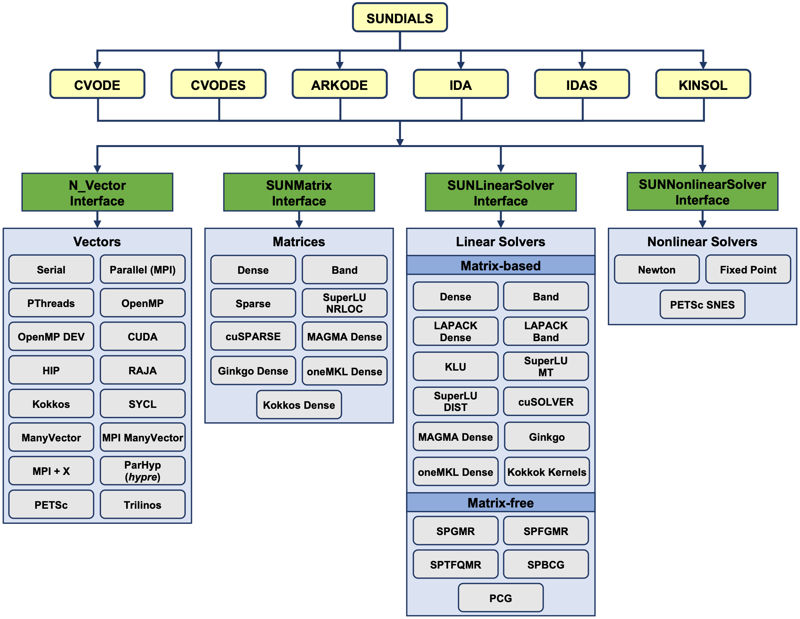

What is scikit-SUNDAE?
======================
scikit-SUNDAE is a Python package that provides bindings to `SUNDIALS <https://sundials.readthedocs.io/>`_ CVODE and IDA integrators. These integrators are widely used for solving complex initial value problems, making scikit-SUNDAE a powerful tool for researchers and engineers working in computational science and engineering.

SUNDIALS, or the SUite of Nonlinear and DIfferential/ALgebraic equation Solvers, is a collection of advanced numerical solvers designed for the efficient and robust solution of differential equations. Within the SUNDIALS suite, CVODE and IDA are typically used for the following:

* **CVODE:** Specializes in solving ordinary differential equations (ODEs) that arise in a variety of fields, such as physics, engineering, and biology. It handles both stiff and non-stiff systems of equations, making it adaptable to many real-world applications.
* **IDA:** Solves differential-algebraic equations (DAEs), which often appear in systems where some of the equations describe algebraic constraints. These problems arise in applications like multi-body dynamics, chemical kinetics, and electrical circuits.

Use cases
=========
Both **CVODE** and **IDA** are ideal for problems that involve systems of coupled differential equations. They are particularly suited to:

* Time-dependent simulations of physical systems
* Kinetics and chemical reaction modeling
* Structural dynamics involving differential-algebraic systems
* Battery modeling, fuel cell simulations, and energy storage applications

Bindings limitations
====================
While scikit-SUNDAE brings the powerful functionality of CVODE and IDA into the Python ecosystem, it does not wrap every feature available in the SUNDIALS library. In particular:

* Only direct solvers are currently included. There is no access to the iterative solvers. If you need access to these, we recommend using `scikits-odes <https://scikits-odes.readthedocs.io/>`_ instead.
* The package focuses on providing access to the SUNDIALS serial vector interface and default linear/nonlinear solvers. Where appropriate, optional solvers licensed under BSD-3 may also be incorporated (e.g., SuperLU_MT and OpenBLAS).
* There are no plans to wrap advanced parallel vector interfaces (e.g., MPI, PThreads, CUDA, etc.) nor optional solvers (e.g., KLU) that may have licensing conflicts with our BSD-3.

While scikit-SUNDAE offers a convenient interface to key solvers in the SUNDIALS suite, there is no intention to wrap the entire SUNDIALS library. Given the large number of optional solvers and interfaces available (shown in the figure below), wrapping everything would be a significant challenge. Instead, scikit-SUNDAE focuses on providing efficient and streamlined access to the essential features of the CVODE and IDA integrators, ensuring the package remains lightweight and user-friendly.

Acknowledgements
================
We extend our appreciation to the developers and maintainers of the SUNDIALS project for their exceptional work in creating a robust, reliable, and open-source suite of solvers. Full details on the SUNDIALS license and copyright information can be found `here <https://github.com/LLNL/sundials/blob/main/LICENSE>`_. For the sparse solver implementation we would also like to thank the developers of `SuperLU_MT <https://github.com/xiaoyeli/superlu_mt>`.

We also acknowledge the `scikits-odes <https://scikits-odes.readthedocs.io/>`_ package, which similarly provides Python bindings to SUNDIALS. While scikit-SUNDAE's API was largely modeled after scikits-odes to maintain a familiar structure, it is important to note that scikit-SUNDAE is an independently developed package, sharing no source code with scikits-odes.

If you are comparing scikits-odes to scikit-SUNDAE, you should consider the following differences:

* **scikits-odes** includes iterative solvers and some optional solvers (e.g., LAPACK). The package only provides source distributions, so users must configure and compile SUNDAILS on their own.
* **scikit-SUNDAE** includes sparse solvers, more flexible events function capabilities (e.g., direction detection and terminal flags), scipy-like output, and provides both binary and source distributions. Users not already familiar with SUNDIALS will likely prefer scikit-SUNDAE due to the streamlined installation process.

scikit-SUNDAE was authored by the National Renewable Energy Laboratory (NREL), operated by Alliance for Sustainable Energy, LLC, for the U.S. Department of Energy (DOE). The views expressed in the project and documentation do not necessarily represent the views of the DOE or the U.S. Government.
